# 机械臂定位抓取目标物体
版本：V1.0

时间：2023/11/21

## 1. 介绍

```
    为了减少机械臂在产品分类、抓取过程中的执行时间，降低定位误差，以提高生产效率。针对传统机器人仅能执行预定义轨迹任务的局限性，本文提出一种结合视觉识别系统的机械臂抓取方案。执行抓取任务的执行装置采用六轴机械臂xArm；最后，使用眼在手上(Eye-in-Hand)视觉-机械臂方案实现对多个物体的识别与抓取，并根据设定规则进行码垛，测试结果验证了所提方案的有效性和鲁棒性。
```

### 1.1 本项目提供两种模式下的抓取演示(自上而下，不涉及旋转):

 |          <font size="3">***Eye-in-hand  眼在手上***</font>          |          <font size="3">***Eye-to-hand  眼在手外***</font>          | 
 |:---------------------------------------------------------------:|:---------------------------------------------------------------:| 
 | 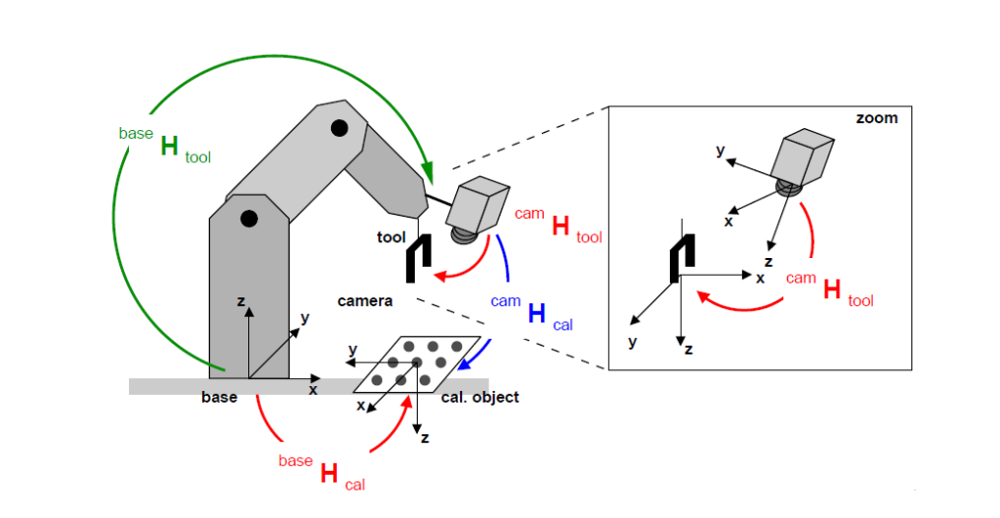 | 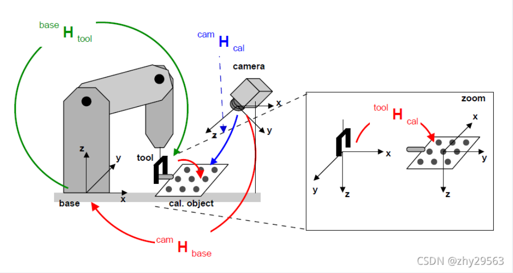 | 

### 1.2 智能抓取系统构成

 |        <font size="3">***硬件设施（Eye-in-Hand）***</font>         |               <font size="3">***软件框架***</font>               | 
 |:------------------------------------------------------------:|:------------------------------------------------------------:| 
| 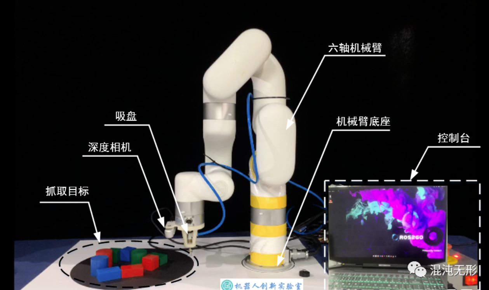 | 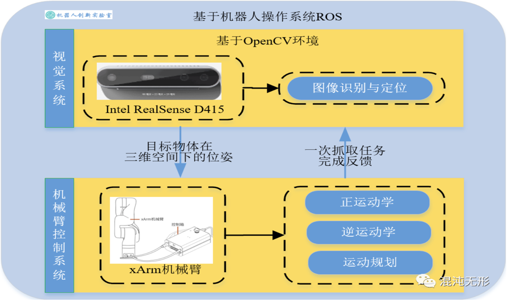 |


## 2. 配置

### 2.1 项目file文件中已包含大部分使用说明文档：

###### cr5相关文档 - https://github.com/Dobot-Arm
[`CR5用户手册`](./file/CR5/CR5用户手册.pdf)
[`Dobot CR5 硬件使用手册V2.3`](./file/CR5/Dobot CR5 硬件使用手册V2.3.pdf)
[`DobotSCStudio 用户手册(CR机器人)`](./file/CR5/DobotSCStudio 用户手册(CR机器人).pdf)
[`Lua脚本编程用户手册（CR机器人）`](./file/CR5/Lua脚本编程用户手册（CR机器人）.pdf)
[`机械爪`](./file/CR5/机械爪.pdf)
[`如何使用末端的485`](./file/CR5/如何使用末端的485.pdf)

###### xArm6相关文档 - https://github.com/xArm-Developer
[`xArm 开发者手册`](./file/xArm6/xArm 开发者手册-V1.8.5.pdf)
[`xArm 技术规格参数表`](./file/xArm6/xArm 技术规格参数表.pdf)
[`xArm 用户手册`](./file/xArm6/xArm 用户手册-V1.8.6.pdf)
[`xArm技术参数手册`](./file/xArm6/xArm技术参数手册.pdf)
[`xArm机械爪用户手册`](./file/xArm6/xArm机械爪用户手册-V1.6.1.pdf)

### 2.2 其他相关信息，请点击下方所需链接自行下载（链接包括文档、sdk、.exe、code等）：

 |                     <font size="3">***硬件模块***</font>                     |                                  <font size="3">***文档地址***</font>                                   |                  <font size="3">***软件下载地址***</font>                  | 
 |:------------------------------------------------------------------:|:---------------------------------------------------------------------------------------------------:|:--------------------------------------------------------------:| 
 | 工业机械臂([CR](https://dobot.cn/)/[xArm](https://www.cn.ufactory.cc/)) |                           [<u>`CR5`</u>][CR5] or [<u>`xArm6`</u>][xArm6]                            | [<u>`cr5.exe`</u>][cr5_exe] or [<u>`xarm6.exe`</u>][xarm6_exe] | 
 |          RealSense([官网](https://www.intelrealsense.com/))          | [<u>`Download`</u>][Download] / [<u>`Documentation`</u>][Documentation] / [<u>`Github`</u>][Github] |                 [<u>`.exe`</u>][realsense_exe]                 | 
 |                            上位机(windows)                            |                                                10,11                                                |                               /                                | 

[cr5_exe]:https://download.dobot.cc/dobotscstudio/DobotSCStudio-windows-offline-installer-2.3.1_stable.exe

[xarm6_exe]:https://208053ea-ca3f-436b-a37a-9a40911a8e3a.filesusr.com/archives/896670_0ab554489e3541839a64def8f5d0b87c.zip?dn=UfactoryStudio-client-x64-1.0.1.zip

[realsense_exe]:https://github.com/IntelRealSense/librealsense/releases/download/v2.49.0/Depth.Quality.Tool.exe

[CR5]:https://dobot.cn/products/cr-series/cr5.html

[xArm6]:https://www.cn.ufactory.cc/xarm-download

[Download]: https://github.com/IntelRealSense/librealsense/releases/latest

[Documentation]:https://dev.intelrealsense.com/docs?_ga=2.179379684.1979369618.1700469929-2136942285.1700469929

[Github]:https://github.com/IntelRealSense/librealsense


## 3. 整体流程

### 3.1 视觉（略）
```
这部分内容暂时略，默认同学们会使用视觉检测算法，无论采取何种检测算法，输出图像的二维坐标（抓取点）即可。
```

###### ***推荐yolo系列算法——Official YOLOv7*** - https://github.com/WongKinYiu/yolov7

Implementation of paper - [YOLOv7: Trainable bag-of-freebies sets new state-of-the-art for real-time object detectors](https://arxiv.org/abs/2207.02696)

[](https://paperswithcode.com/sota/real-time-object-detection-on-coco?p=yolov7-trainable-bag-of-freebies-sets-new)
[](https://huggingface.co/spaces/akhaliq/yolov7)
<a href="https://colab.research.google.com/gist/AlexeyAB/b769f5795e65fdab80086f6cb7940dae/yolov7detection.ipynb"></a>
[](https://arxiv.org/abs/2207.02696)

### 3.2 抓取目标物体
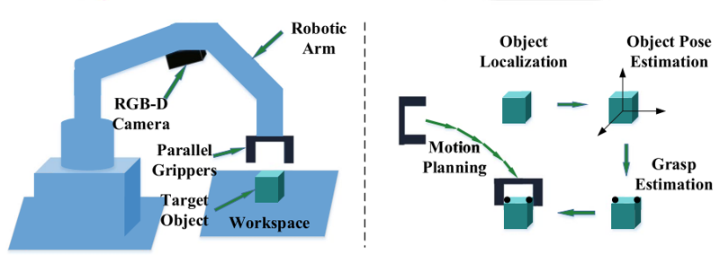 

```
这部分内容可参考相关博客和论文，这里做大致的流程讲解（Eye_in_hand）
```
<br/>

#### 3.2.1 说明
- 总的来说，机械臂定位抓取目标物体，其实就是将获取的二维图像的抓取坐标点位(x,y)转化成机器人空间中的(x,y,z)三维坐标，我们通常将整个过程称为 <font color="#FF9912">**坐标变换**</font>。
- 首先，明确机器人空间中存在的四个坐标系：<font color="#FF9912">**base-机器人的基坐标系、tool / gripper-机器人末端工具坐标系、cam-相机坐标系、cal / target-标定板坐标系**</font>。
- 而 <font color="#FF9912">**坐标变换**</font> 就是利用上述四个坐标系进行 <font color="#FF9912">**刚性位姿变换**</font>，获取坐标系之间的 <font color="#FF9912">***相对位姿（位置和姿态）矩阵 T***</font>。
<div align="center">
    <a href="./">
        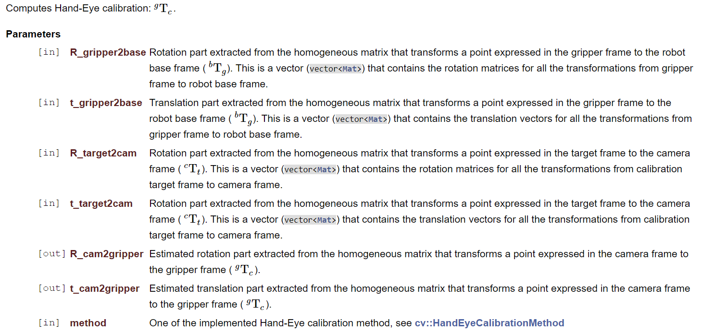
    </a>
</div>

- 其次，空间中存在**已知的**相对位姿矩阵和**未知的**相对位姿矩阵，需要利用到特定的方法获取： <font color="#FF9912">**手眼标定、相机标定**</font> 等。


**手眼标定** - See [opencv - calibrateHandEye()](https://docs.opencv.org/4.4.0/d9/d0c/group__calib3d.html#ga3207604e4b1a1758aa66acb6ed5aa65d)函数部分.
```
联立AX=XB矩阵方程，求解未知量矩阵X，X在不同模式下：
（Eye_in_hand）：即相机固定在机器人末端，求解cam与tool的相对位姿矩阵X。
（Eye_to_hand）：即相机固定在机器人外部，求解cam与base的相对位姿矩阵X。
```
<div align="center">
    <a href="./">
        
    </a>
</div>

**相机标定** - See [opencv Camera Calibration and 3D Reconstruction - Detailed Description](https://docs.opencv.org/4.4.0/d9/d0c/group__calib3d.html#gad10a5ef12ee3499a0774c7904a801b99) 模块描述部分.
```
为获取相机的内参矩阵、畸变矩阵、外参矩阵。
```
 |   <font size="3">***标定方法***</font>   |<font size="3">***优点***</font>| <font size="3">***缺点***</font> |      <font size="3">***常用方法***</font>      |  
 |:------------------------------------:|:----------------------------:|:------------------------------:|:------------------------------------------:| 
 | <font color="#FF9912">传统相机标定法</font> |       可使用于任意的相机模型、 精度高       |           需要标定物、算法复杂           | Tsai两步法、<font color="#FF9912">张氏标定法</font> | 
 |              主动视觉相机标定法               |       不需要标定物、算法简单、鲁棒性高       |            成本高、设备昂贵            |               主动系统控制相机做特定运动                | 
 |                相机自标定法                |          灵活性强、可在线标定          |            精度低、鲁棒性差            |             分层逐步标定、基于Kruppa方程              | 
<font size="2">*表中黄色字体所选的方法为我们所采用的方法，其他方法请自行查阅。</font>

<br/>

#### 3.2.2 大致流程（Eye_in_hand）：
1. 相机标定：获取相机的`内参矩阵`、`相机畸变矩阵`和`外部参数`
2. 与`步骤1`同步进行，获取相机标定过程中记录`机器人末端工具坐标系相对于机器人基坐标系`的变换矩阵
3. 求解公式`AX=XB`，其中X在Eye_in_hand中为`机器人末端工具坐标系相对于相机坐标系`的变换矩阵，在Eye_to_hand中为`标定板坐标系相对于相机坐标系`的变换矩阵，具体按所求参数决定
4. 结合机器人刚性变换公式，求解出`目标物体坐标系相对于机器人基坐标系`的变换矩阵，控制机器人末端坐标系与之坐标重合，实现自上而下的定位抓取

<br/>

#### 3.2.3 具体操作（Eye_in_hand）：
<div align="center">
    <a href="./">
        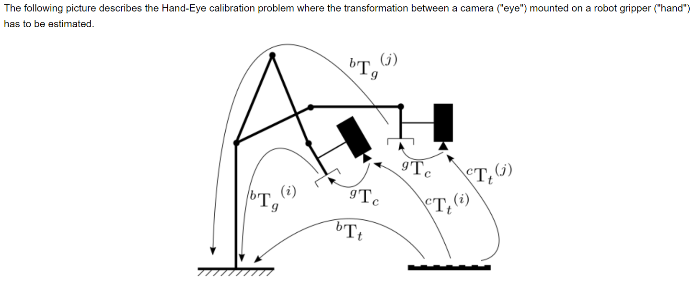
    </a>
</div>

- a static calibration pattern is used to estimate the transformation between the target frame and the camera frame
1. 打印A4纸大小的标定纸张（标定板可以直接从opencv官网下载：[标定板](https://docs.opencv.org/2.4/_downloads/pattern.png)）
<div align="center">
    <a href="./">
        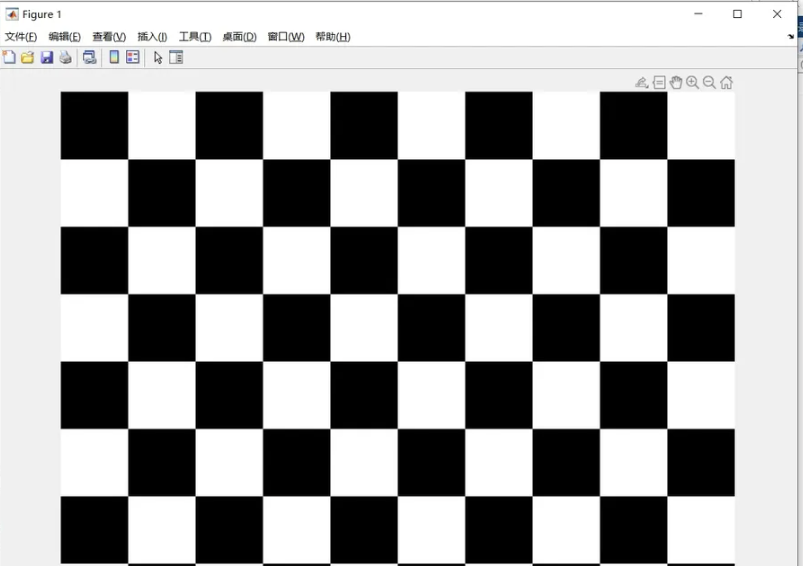
    </a>
</div>
2. 打印完成后，测量实际打印出的网格边长（注意单位）。将打印纸贴附在硬纸板上（粘贴的尽可能平整）。
<div align="center">
    <a href="./">
        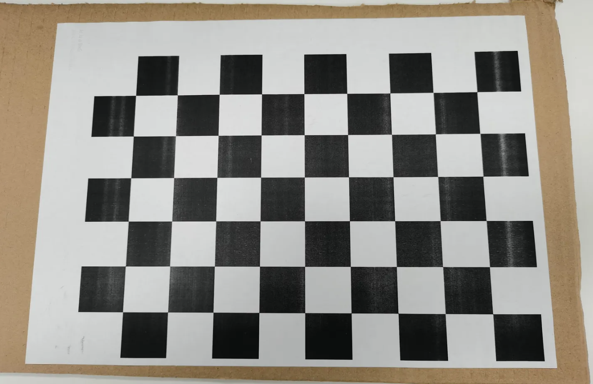
    </a>
</div>

<br/>

- the robot gripper is moved in order to acquire several poses
- for each pose, the homogeneous transformation between the gripper frame and the robot base frame is recorded using for instance the robot kinematics
1. 固定好相机，连接相机，使用realsense api获取的相机内参矩阵和畸变系数（默认为0，realsense相机没有畸变）。
2. 改变机器人末端位姿，拍摄不同角度下的标定板并记录不同角度下机械臂末端工具坐标系的位姿矩阵。
3. 重复第2个步骤14-20次左右。
4. 完成上述流程，共获取N对 工具坐标系tool / gripper2base 以及对应的 标定板图片，注意一一对应的命名。
<div align="center">
    <a href="./">
        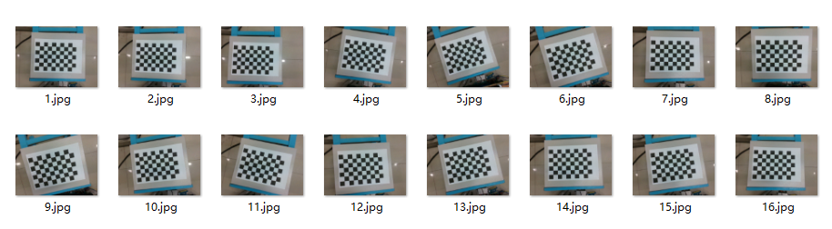
        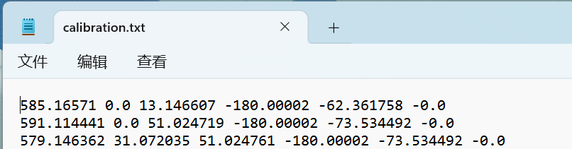
    </a>
</div>

<br/>

- for each pose, the homogeneous transformation between the calibration target frame and the camera frame is recorded using for instance a pose estimation method (PnP) from 2D-3D point correspondences
1. 利用opencv内置的solvePnP()函数，获取N个 cal / target2cam矩阵。

<br/>

- The Hand-Eye calibration procedure returns the following homogeneous transformation
1. 利用opencv内置的calibrateHandEye()函数，求解AX=XB。

<br/>

- Kinematic transformation pose matrix of rigid body motion of robot
1. 位姿变换求解 目标物体坐标系相对于机器人基座系 <mark>obj2base = tool2base * cam2tool * cam *obj</mark>
2. 控制机器人的api函数运动到指定位置，实时抓取动作。

<br/>

Note:
- A minimum of 2 motions with non parallel rotation axes are necessary to determine the hand-eye transformation. So at least 3 different poses are required, but it is strongly recommended to use many more poses.
1. 确定手眼变换至少需要2个非平行旋转轴的运动。因此，至少需要3个不同的姿势，但强烈建议使用更多的姿势。

<br/>

#### 3.2.4 相关算子：
上述具体操作中还包含其他算子，包括标定版角点检测，亚像素角点细化，手动设定三维坐标等参数，需要同学们自己去查看相应算子，see [OpenCV](https://docs.opencv.org/4.4.0/index.html)。
- convertPointsToHomogeneous(): 非齐次坐标转换齐次坐标
- convertPointsFromHomogeneous(): 齐次坐标转换非齐次坐标
- findChessboardCorners(): 检测标定板角点
- find4QuadCornerSubpix(): 亚像素角点细化
- findCirclesGrid(): 寻找圆形标定板角点
- drawChessboardCorners(): 绘制检测到的角点
- calibrateCamera(): 从校准图案的多个视角中找出摄像机内部和外部参数（内置solvePnP()）
- initUndistortRectifyMap(): 计算矫正图像需要的映射矩阵
- remap(): 去掉原始图像中的畸变
- undistort(): 对原始图像进行矫正
- projectPoints(): 用于计算世界坐标系的三位点投影到像素坐标系中的二维坐标
- solvePnP(): 计算世界坐标系到相机坐标系的旋转向量和平移向量
- solvePnPRansac(): 同上并引入Ransac算法消除含有较大误差的数据
- Rodrigues(): 实现旋转向量和旋转矩阵的相互转换
- stereCalibrate(): 双目视觉标定

## 4. 结语
<font face="楷体" size=3><strong>
对于机械臂定位抓取目标物体，涉及到视觉，相机，机械臂方面的知识
<br/>
视觉的相关知识，简单的demo就使用传统视觉算法，对抓取物体有要求的可使用深度学习目标检测算法
<br/>
相机的相关知识，请查看博客和官网文档自行学习
<br/>
机械臂的相关知识，可翻阅书籍 机器人学基础 中空间描述坐标变换，运动学，轨迹规划等章节
<br/>
项目中的代码只是提供一个大致的逻辑框架，同学们需要自行查漏补缺，写出适合自己的代码
<br/>
整个过程中的每一步操作都会对最后抓取结果的精确度造成不同程度的影响，理想结果是 在消除定长误差下保持x,y,z轴±1mm的误差
<br/>
对结果造成影响的可能：工具坐标系的标定，SolvePnP算子的解AX=XB的方法等
<br/>
尽可能保证每一步计算的三维空间坐标逼近真实值，可利用类似于重投影误差算子进行验算，matlab工具箱验算等
<br/>
当实现对指定目标物体进行自上而下的抓取后，可拓展更多自由度的抓取...
</font><strong>